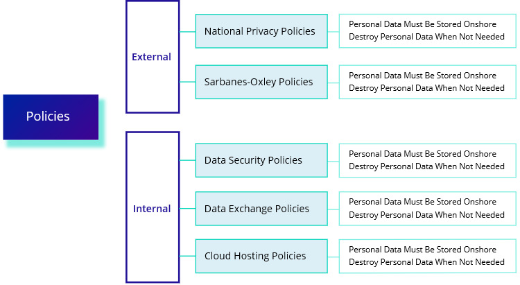

# Policies

Policies are overarching organizational norms typically of a restrictive nature providing compulsory prescriptions in certain areas.

Policies prescribe norms, they are compulsory and restrictive, they are strict rules, where deviation from these rules is prohibited within the organization. This may include privacy policies, audit, data security policies, data exchange policies, cloud hosting policies. Policies are generally precise formulations of what "should not" be done. They are used by organizations which have sensitive data \(e.g. financial and personal data\) working in more regulated industries \(e.g. banking and healthcare\).

### 

### Template

Document contains policies.

Policies may be categorized as follows:

* External
* Internal

Each policy has the following:

* Name - short name which identifies the policy
* Description - description of the policy

### Example

**EXTERNAL POLICIES**

_**National Privacy Policies**_

Policy 1: Personal Data Must Be Stored Onshore

* Description: Personal data must be stored within the country where the person is currently residing, so this includes and data collection, processing and storage.

Policy 2: Destroy Personal Data When Not Needed

* Description: Personal data must be destroyed for customers who have chosen to delete their accounts.

_**Sarbanes-Oxley Policies**_

Policy 3: Log All Accesses to Accounting Systems

* Description: Whenever a user accesses an account system, it is required that the system logs the timestamp, the user id as well as the action that was performed.

Policy 4: Retain Audit Trails and Emails for 5 Years

* Description: Audit trails and emails must be retained for 5 years, i.e. from the moment of creation \(audit trail timestamp, email timestamp\) up to 5 years from the timestamp, and after that they should be deleted.

**INTERNAL POLICIES**

_**Data Security Policies**_

Policy 5: No Sensitive Data on Mobile Devices

* Description: Sensitive data about customers and employees must not be stored on mobile.

Policy 6: Store Credit Cards in Encrypted Formats

* Description: Credit cards should be encrypted using the encryption algorithm &lt;insert name of encryption algorithm&gt; and CVV must not be stored.

_**Data Exchange Policies**_

Policy 7: Do Not Share Key Data with Third Parties

* Description: Data must not be shared with any third parties that the software is integrated with, nor shared with employees of any third party companies

Policy 8: Share Client Data with Trusted Partners

* Description: Client data can only be shared with the trusted partners, as listed in &lt;insert name of document&gt;

_**Cloud Hosting Policies**_

Policy 9: Use Only the PCI DSS Compliant Cloud

* Description: Only PCI DSS Compliant Cloud providers can be used - which currently includes: AWS, Azure, Google Cloud

Policy 10: Only stored encrypted Health Data in the Cloud

* Description: Based on HIPAA, any health data stored on the cloud must be enrypted using the algorithm &lt;insert name of encryption algorithm&gt;

### References

Source: Enterprise Architecture on a Page v1.4 \([http://eaonapage.com](http://eaonapage.com)\), Svyatoslav Kotusev \([http://kotusev.com](http://kotusev.com)\)

