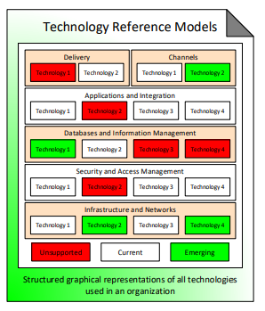
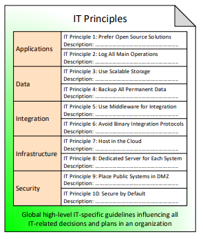
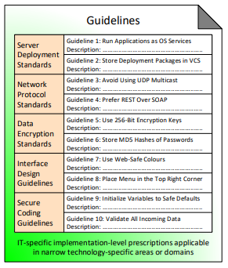

# Standards

Standards are used to describe the goal technical rules, standards, guidelines, best practices and patterns enabling a proven reusable mechanism for solution implementation. They are developed as-necessary by architects and technical experts, and periodically updated. They help to achieve technical consistency and uniformity as well as regulatory compliance. They decrease the delivery time for IT initiatives, reduce the related costs, risks and complexity.

### Overview

 **Content:** Global technical rules, standards, patterns and best practices relevant to IT systems  
**Focus:** Do not focus on specific points in time or focus on the current state  
**Format:** Can be expressed in various formats, often using strict notations

 **Meaning:** Decisions on how all IT systems should be implemented and some facts on the current approaches and technologies  
**Usage:** Developed collaboratively by architects and technical subject-matter experts and used to shape the architectures of all IT initiatives \(see Enterprise Architecture Practice on a Page\)  
**Lifecycle:** Established on an as-necessary basis and updated according to the ongoing technology progress

 **Role:** Proven reusable means for IT systems implementation  
**Purpose:** Help achieve technical consistency, technological homogeneity and regulatory compliance  
**Benefits:** Faster initiative delivery, reduced costs, risks and complexity

### Technical Reference Models

They represent graphically the technologies used in the organizations, in order to manage and consolidate the technology portfolio.

Example divisions are:

* Applications and Integration
* Databases
* Security
* Infrastructure and Networks

For each of these, marking the status: Unsupported, current, Emerging.

### IT Principles

IT principles are high level IT guidelines which influence all IT decisions and plans.

Principle:

* Name
* Description

### Guidelines

Provide implementation-level prescriptions in certain technology-specific or domain-specific areas, so that architects and subject matter experts can share and reuse best practices.

Guidelines have:

* Name
* Description

Examples of guidelines are for deployment, Networking, Data Encryption, Interface Design, Development.

### References

Source: [http://eaonapage.com/](http://eaonapage.com/)

