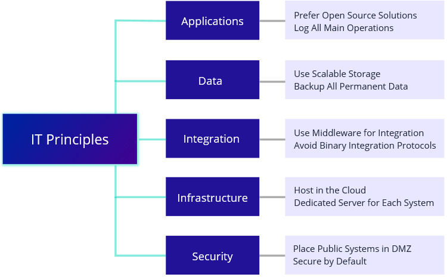

# IT Principles

Global high-level IT-specific guidelines influencing all IT-related decisions and plans in an organization.

IT principles are high level IT guidelines which influence all IT decisions and plans. They may also be derived from the Business Principles.

### Template

Each principle has the following structure:

* Name - short name which identifies the principle
* Description - describes the principle based on the aspects below:
  * Statement - provides a more extended definition of the principle
  * Rationale - justifies the reasons why this principle is adopted
  * Implications - describes the consequences of adhering to the principle

### Example

**Applications**

<table>
  <thead>
    <tr>
      <th style="text-align:left">Principle</th>
      <th style="text-align:left">Description</th>
    </tr>
  </thead>
  <tbody>
    <tr>
      <td style="text-align:left">IT Principle 1: Prefer Open Source Solutions</td>
      <td style="text-align:left">
        <ul>
          <li>Statement: Choose open source solutions whenever possible</li>
          <li>Rationale: Open Source solutions are more cost effective, have a greater
            community and support compared to proprietary solutions</li>
          <li>Implications: Systems should use open source components except in cases
            where the open source solution doesn&apos;t address needs or where commercial
            support is required</li>
        </ul>
      </td>
    </tr>
    <tr>
      <td style="text-align:left">IT Principle 2: Log All Main Operations</td>
      <td style="text-align:left">
        <ul>
          <li>Statement: All main operations should be logged at the &quot;INFO&quot;
            level</li>
          <li>Rationale: Logging are essential for troubleshooting at the production,
            and by logging main operations it helps in diagnostics to find what was
            executed</li>
          <li>Implications: Development teams should identify the main operations and
            using the INFO level logging</li>
        </ul>
      </td>
    </tr>
  </tbody>
</table>

**Data**

<table>
  <thead>
    <tr>
      <th style="text-align:left">Principle</th>
      <th style="text-align:left">Description</th>
    </tr>
  </thead>
  <tbody>
    <tr>
      <td style="text-align:left">IT Principle 3: Use Scalable Storage</td>
      <td style="text-align:left">
        <ul>
          <li>Statement: Horizontally scalable storage mechanisms (e.g. NoSQL databases)
            should be used to handle large and growing data volumnes</li>
          <li>Rationale: Scalable storage enables the organization to deal with the
            growing data sizes by scaling horizontally which enables us to deal with
            future data requirements in a cost efficient way</li>
          <li>Implications: Scalable storage should be preferred where we expect significant
            growth in data volume in the future</li>
        </ul>
      </td>
    </tr>
    <tr>
      <td style="text-align:left">IT Principle 4: Backup All Permanent Data</td>
      <td style="text-align:left">
        <ul>
          <li>Statement: All master data should be backed-up at a geographically separated
            server location</li>
          <li>Rationale: Backup is essential in case of data corruption or data loss,
            to be able to restore the data as part of disaster recovery to ensure that
            business operations continue running</li>
          <li>Implications: Permanent data needs to be identified for each system, and
            backup should be ensured for such data</li>
        </ul>
      </td>
    </tr>
  </tbody>
</table>

**Integration**

<table>
  <thead>
    <tr>
      <th style="text-align:left">Principle</th>
      <th style="text-align:left">Descriptio</th>
    </tr>
  </thead>
  <tbody>
    <tr>
      <td style="text-align:left">IT Principle 5: Use Middleware for Integration</td>
      <td style="text-align:left">
        <ul>
          <li>Statement: Middleware should be used for integration with external systems
            instead of custom development</li>
          <li>Rationale: Using middleway for integration is more cost efficient and
            avoids maintenance issues due to updates in external systems</li>
          <li>Implications: When integrating with well-known systems, middleware solutions
            should be investigated and preferred over custom integration development</li>
        </ul>
      </td>
    </tr>
    <tr>
      <td style="text-align:left">IT Principle 6: Avoid Binary Integration Protocols</td>
      <td style="text-align:left">
        

        <ul>
          <li>Statement: HTTP protocols should be used instead of binary protocols due
            to their universality, understandability and flexibility (and binary protocols
            should only be used where extremely low latency is critical)</li>
          <li>Rationale: HTTP / AMPQ protocols are more universal, flexible and developer-friendly
            (lower development cost), whereas binary protocols offer much higher speed
            but are harder to maintain</li>
          <li>Implications: HTTP protocols should be used by default for integration,
            and avoid binary protocols except in rare cases where low latetency is
            a must</li>
        </ul>
      </td>
    </tr>
  </tbody>
</table>

**Infrastructure**

<table>
  <thead>
    <tr>
      <th style="text-align:left">Principle</th>
      <th style="text-align:left">Description</th>
    </tr>
  </thead>
  <tbody>
    <tr>
      <td style="text-align:left">IT Principle 7: Host in the Cloud</td>
      <td style="text-align:left">
        

        <ul>
          <li>Statement: Applications should be hosted in the cloud rather than on-premise</li>
          <li>Rationale: Cloud hosting is preferred because it enables easier scalability,
            pay-as-you-go model rather than higher fixed costs and also higher relaibility</li>
          <li>Implications: For any new applications, cloud hosting should be the default
            choice and only using on-premise in exceptional circumstances</li>
        </ul>
      </td>
    </tr>
    <tr>
      <td style="text-align:left">IT Principle 8: Dedicated Server for Each System</td>
      <td style="text-align:left">
        

        <ul>
          <li>Statement: Dedicated Server (instead of Shared Server) should be used
            for each system</li>
          <li>Rationale: Dedicated Servers enable higher customizability and flexibility,
            fuller control over CPU, RAM and disk storage</li>
          <li>Implications: Each system should have a dedicated server, except for systems
            which are very low resource intensive</li>
        </ul>
      </td>
    </tr>
  </tbody>
</table>

**Security**

<table>
  <thead>
    <tr>
      <th style="text-align:left">Principle</th>
      <th style="text-align:left">Description</th>
    </tr>
  </thead>
  <tbody>
    <tr>
      <td style="text-align:left">IT Principle 9: Place Public Systems in DMZ</td>
      <td style="text-align:left">
        

        <ul>
          <li>Statement: Publish Systems should be placed in demilitarized zone (DMZ),
            a subnetwork between the public internet and private networks</li>
          <li>Rationale: Public systems should be in DMZ because it adds an additional
            security layer by restricting access to sensitive servers and sensitive
            data</li>
          <li>Implications: Systems should be separated as public and private, whereby
            private services should be in private networks and public services should
            be in DMZ</li>
        </ul>
      </td>
    </tr>
    <tr>
      <td style="text-align:left">IT Principle 10: Secure by Default</td>
      <td style="text-align:left">
        

        <ul>
          <li>Statement: Systems should be secure by default, which means using the
            most secure posssible configuration settings as the default</li>
          <li>Rationale:</li>
          <li>Implications:</li>
        </ul>
      </td>
    </tr>
  </tbody>
</table>

### References

Source: Enterprise Architecture on a Page v1.4 \([http://eaonapage.com](http://eaonapage.com)\), Svyatoslav Kotusev \([http://kotusev.com](http://kotusev.com)\)

