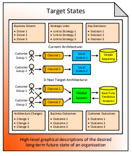

# Visions

Visions provide a high level conceptual overview of the organization from the business perspective. This enables Business and IT to have a shared view of the company and its future. They help to better identify and prioritize IT investments based on long term  business outcomes, thus enabling IT investments to have higher strategic effectiveness.

### Overview

**Content:** High-level conceptual descriptions of an organization from the business perspective  
**Focus:** Often focus on the long-term future up to 3-5 years ahead  
**Format:** Expressed in brief informal formats, often as simple one-page diagrams

**Meaning:** Decisions on what IT should deliver to an organization in the long run  
**Usage:** Developed collaboratively by senior business leaders and architects and then used to guide IT investments, identify, prioritize and launch new IT initiatives \(see Enterprise Architecture Practice on a Page\)  
**Lifecycle:** Created once and then updated according to the ongoing changes in strategic business priorities

**Role:** Shared views of an organization and its future agreed by business and IT  
**Purpose:** Help achieve the alignment between IT investments and long-term business outcomes  
**Benefits:** Improved strategic effectiveness of IT investments

### 

### References

Source: Enterprise Architecture on a Page v1.4 \([http://eaonapage.com](http://eaonapage.com)\), Svyatoslav Kotusev \([http://kotusev.com](http://kotusev.com)\)

