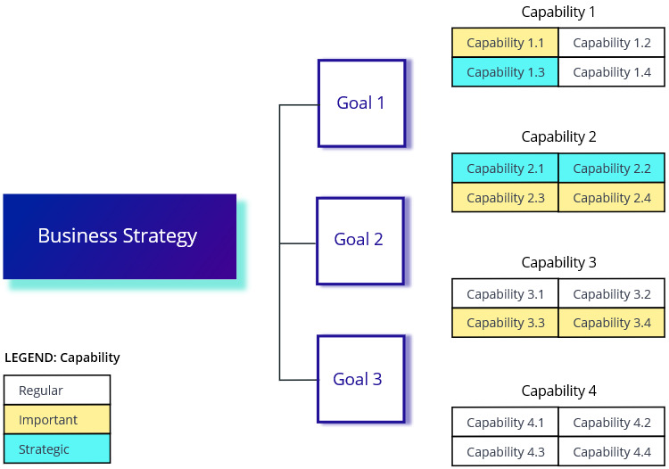

# Business Capability Models

Structured graphical representations of all organizational business capabilities, their relationship and hierarchy

Business Capacity Models help visualize organizational business capabilities, so that future IT investments can be focused on the most critical business areas. One page artefacts with color-coding, heatmapped representation.

### Template

* Business Strategy
* Goals
* Capabilities \(Level 1 and Level 2\)
  * Level 1 Capabilities
  * Level 2 Capabilities \(and indicate the Investment Status\)
* Investment Priorities: Regular, Important, Strategic

### Example

* Business Strategy
* Goals
  * Goal 1
  * Goal 2
  * Goal 3
* Capabilities
  * Capability 1
    * Capability 1.1
    * Capability 1.2
    * Capability 1.3
    * Capability 1.4
  * Capability 2
    * Capability 2.1
    * Capability 2.2
    * Capability 2.3
    * Capability 2.4
  * Capability 3
    * Capability 3.1
    * Capability 3.2
    * Capability 3.3
    * Capability 3.4
  * Capability 4
    * Capability 4.1
    * Capability 4.2
    * Capability 4.3
    * Capability 4.4

### References

Source: Enterprise Architecture on a Page v1.4 \([http://eaonapage.com](http://eaonapage.com)\), Svyatoslav Kotusev \([http://kotusev.com](http://kotusev.com)\)

