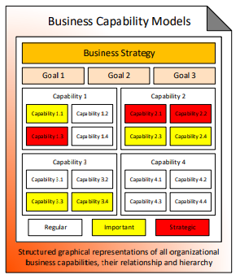

# Business Capability Models

Structured graphical representations of all organizational business capabilities, their relationship and hierarchy

Business Capacity Models help visualize organizational business capabilities, so that future IT investments can be focused on the most critical business areas. One page artefacts with color-coding, heatmapped representation.

Simple representation:

* Identify the Capabilities \(and the Sub-capabilities\)
* indicate the Investment Status \(Underinvested, Adequate or Overinvested\) for each of the Sub-capabilities

Complex representation:

* Describe the Business Strategy and Vision
* Identify the Goals and the Objectives
* Identify the Capabilities \(and the Sub-capabilities\)
* Identify the Markets, Customers, Suppliers and Partners
* Indicate the Priority \(Regular, Important, Strategic\) for the Sub-capabilities, Markets, Customers, Suppliers and Partners
* Indicate the Quality and Cost levels for the Sub-capabilities

Maturity Analysis and Gap Analysis:

* Indicate the Maturity \(Low, Medium High\) for each of the Sub-capabilities, including both the Current Maturity and the Target Maturity
* Based on the Maturity analysis, indicate the Gap level \(No Gap, Small Gap, Large Gap\)

Strategy Mapping:

* For each of the Sub-capabilities, mark the capability components \(P = Processes, S = Staff, I = Information, T = Technology\) with Strategic Priority \(Low, Medium, High\)
* Mark which Capabilities are core and which ones can be outsourced
* Map problems and outcomes to Sub-capabilities

_Note: Capabilities are Level 1, Sub-Capabilities are Level 2_

Examples:

* Business Strategy
* Goals
  * Goal 1
  * Goal 2
  * Goal 3
* Capabilities
  * Capability 1
    * Capability 1.1
    * Capability 1.2
    * Capability 1.3
    * Capability 1.4
  * Capability 2
    * Capability 2.1
    * Capability 2.2
    * Capability 2.3
    * Capability 2.4
  * Capability 3
    * Capability 3.1
    * Capability 3.2
    * Capability 3.3
    * Capability 3.4
  * Capability 4
    * Capability 4.1
    * Capability 4.2
    * Capability 4.3
    * Capability 4.4

