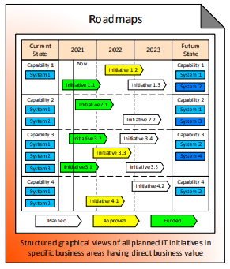

# Roadmaps

Structured graphical views of all planned IT initiatives in specific business areas having direct business value

Roadmaps help visualize the planned IT initiatives in certain business areas so that IT investments can be prioritized based on business importance. The represent tentative IT delivery schedules, with approximate start and end dates.

Simple roadmaps:

* Capabilities, and marking the Priority level \(Normal, High, Critical\)
* Time \(Years\), and also a marker for Now
* For each of the Capabilities, indicate the Initiatives across Time, including the status \(Proposed, Agreed, Active\)

Complex roadmaps:

* Goals
* Time \(Years\) including the planned yearly budget, and market for Now
* Initiatives:
  * Goals are linked to Initiatives
  * Initiatives are linked to Time to represent stat and end
  * There may be dependencies between dependencies \(e.g. an initiative to start after another initiative\)
  * Indicate the Budget level \(Small, Medium, Large\)
  * Indicate the Status \(Planned, Approved, Funded\)
* Current State:
  * Problems
  * Capabilities \(and Systems\)
* Future State:
  * Outcomes
  * Capabilities \(and Systems\)

Exotic roadmaps:

* Time: This Year, Next Year, future
* Business Divisions: Division 1, Division 2, Division 2
* Initiatives with the focus \(Applications, Information, Tools\) and short overview of the goals they attempt to achieve


TODO: Update image below


### Example

* Current State
  * Capability 1
  * Capability 2
  * Capability 3
  * Capability 4
* Years
* Future State

### References

Source: Enterprise Architecture on a Page v1.4 \([http://eaonapage.com](http://eaonapage.com)\), Svyatoslav Kotusev \([http://kotusev.com](http://kotusev.com)\)

